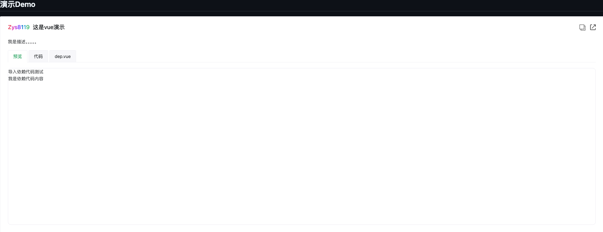

# 基于vue的markdown演示Demo文档

## 安装

```
pnpm i markdown-vue-demo
```

## 使用

1. 引入插件

```ts
// vite.config.ts
import Vue from '@vitejs/plugin-vue'
import MarkdownVueDemo from 'markdown-vue-demo/vite'

export default defineConfig({
  plugins: [
    MarkdownVueDemo({ /* options */ }),
  ],
})
```

2.在markdown中使用如下代码格式:

> vue中markdown解析推荐使用`unplugin-vue-markdown`

````md
``` Demo
# 标题
## 二级标题
title: 标题，等同上面效果
desc: 标题，等同上面效果
other-attributes: 其他属性
...: 更多属性
@/components/Demo.vue
```
````

## 效果

